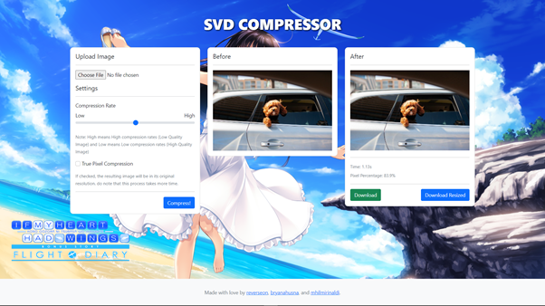

# Pengaplikasian SVD pada Kompresi Gambar
> Proyek ini dibuat untuk memenuhi tugas besar 2 mata kuliah IF2123 Aljabar Linier dan Geometri mengenai pengaplikasian Singular Value Decomposition (SVD) pada kompresi gambar (Image Compression).

## Table Konten
- [Pengaplikasian SVD pada Kompresi Gambar](#pengaplikasian-svd-pada-kompresi-gambar)
  - [Table Konten](#table-konten)
  - [Anggota](#anggota)
  - [Informasi Umum](#informasi-umum)
  - [Library yang digunakan](#library-yang-digunakan)
  - [Fitur](#fitur)
  - [Tangkapan Layar](#tangkapan-layar)
  - [Prasyarat](#prasyarat)
  - [Penggunaan](#penggunaan)
  - [Saran](#saran)
  - [Daftar Pustaka](#daftar-pustaka)

## Anggota
1. Bryan Amirul Husna (13520146)
2. Mohamad Hilmi Rinaldi (13520149)
3. Thirafi Najwan Kurniatama (13520157)

## Informasi Umum
Proyek ini menggunakan konsep low-rank approximation yang diimplementasikan menggunakan SVD untuk meminimisasi data piksel pada sebuah gambar dengan melakukan aproksimasi terhadap piksel awalnya.

SVD (Singular Value Decomposition) merupakan salah satu metode dalam mendekomposisi (memfaktorkan) suatu matriks menjadi hasil kali dari beberapa matriks lain. Dalam SVD ini sebuah matriks didekomposisi menjadi hasil perkalian dari 3 matriks yaitu matriks ortogonal U, matriks diagonal S, dan transpose dari matriks ortogonal V.

## Library yang digunakan
- GPUjs
- Bootstrap
- OpenCV
- MathJS

## Fitur
- Kompresi Gambar dengan berbagai Level Kompresi
- Kompresi Gambar secara TruePixel
    - TruePixel berarti gambar yang dihasilkan akan mengikuti resolusi awalnya. Namun proses mungkin menjadi lebih lama.
- Kompresi Gambar dengan transparansi tidak berubah.
- Unduh hasil kompresi ke ukuran asli.
  - Jika tidak memilih TruePixel, gambar hasil kompresi akan diubah ukurannya. untuk mendapatkan resolusi awal, bisa menggunakan fitur ini.

## Tangkapan Layar

<!-- If you have screenshots you'd like to share, include them here. -->

## Prasyarat
- Pastikan ada Koneksi Internet dan Stabil karena dibutuhkan untuk mengunduh library yang digunakan

## Penggunaan
- Buka index.html di folder _src_
- Masukan gambar dengan memilih _choose file_ di bagian _upload image_
- Sesuaikan setelan kompresi
- Klik Kompres
- Setelah Kompresi Selesai, akan muncul tombol untuk mengunduh gambar hasil kompresi

## Saran
- Algoritma SVD yang kami buat ini masih cukup lambat untuk gambar yang memiliki ukuran sisi terkecil lebih dari 800 piksel sehingga diperlukan optimisasi algoritma lebih lanjut.
- Pada beberapa kasus, gambar hasil kompresi lebih besar ukurannya daripada gambar aslinya. Maka dari itu, dibutuhkan untuk mencari nilai kompresi yang optimal.

## Daftar Pustaka
> Golub, G.H., Reinsch, C. Singular value decomposition and least squares solutions. Numer. Math. 14, 403–420 (1970). https://doi.org/10.1007/BF02163027
> 
> Tony F. Chan. 1982. An Improved Algorithm for Computing the Singular Value Decomposition. ACM Trans. Math. Softw. 8, 1 (March 1982), 72–83. https://doi.org/10.1145/355984.355990
> 
> Munir, Rinaldi. 2020. “Nilai Eigen dan Vektor Eigen Bagian 1” https://informatika.stei.itb.ac.id/~rinaldi.munir/AljabarGeometri/2020-2021/Algeo-18-Nilai-Eigen-dan-Vektor-Eigen-Bagian1.pdf
> 
> Munir, Rinaldi. 2021. “Singular Value Decomposition (SVD)” https://informatika.stei.itb.ac.id/~rinaldi.munir/AljabarGeometri/2020-2021/Algeo-19b-Singular-value-decomposition.pdf
